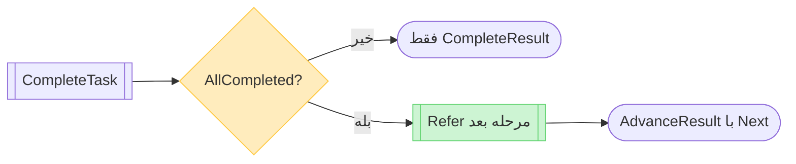
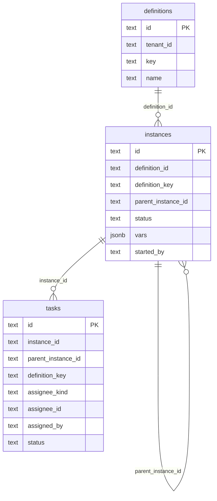
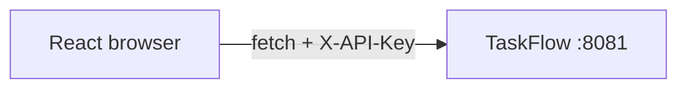
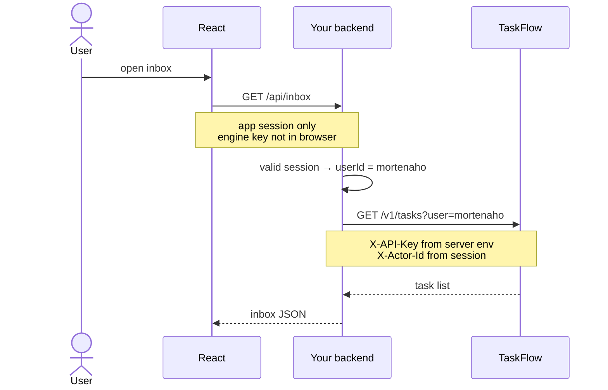
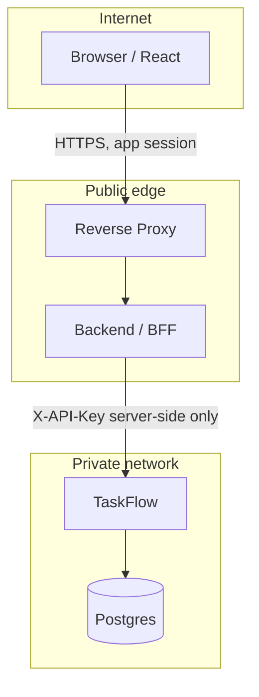

<div dir="rtl">

# معماری سیستم (Architecture)

این موتور گردش کار نیازی به مفسر پیچیدهٔ BPMN ندارد؛ بلکه بر پایهٔ مدل سرراست سه‌گانهٔ «تعریف (Definition)»، «نمونهٔ اجرا (Instance)» و «وظیفه (Task)» طراحی و پیاده‌سازی شده است.

معماری پروژه از الگوی **Clean Architecture** پیروی می‌کند؛ جهت وابستگی‌ها همواره به سمت لایه‌های درونی است و لایهٔ `Domain` هیچ وابستگی یا شناختی نسبت به دیتابیس، پروتکل HTTP، فرمت JSON یا فریم‌ورک‌های بیرونی ندارد.

---

## ۱. ساختار لایه‌بندی پروژه

<div dir="ltr">

```
WorkFlowEngine/
├── src/
│   ├── TaskFlow.Domain/
│   │   ├── Entities/
│   │   ├── ValueObjects/
│   │   ├── Common/
│   │   └── Errors/
│   ├── TaskFlow.Application/
│   │   ├── Engine.cs
│   │   ├── ProcessOrchestrator.cs
│   │   ├── Ports/
│   │   ├── Tenancy/
│   │   └── Results/
│   ├── TaskFlow.Infrastructure/
│   │   ├── Persistence/
│   │   └── Identity/
│   └── TaskFlow.Server/
│       ├── Program.cs
│       ├── Controllers/
│       ├── Http/
│       ├── Requests/
│       └── Contracts/
├── tests/TaskFlow.Tests/
├── examples/
└── docs/
```

</div>

| مسیر | نقش |
|------|-----|
| `Domain/Entities` | موجودیت‌ها: Definition، ProcessInstance، WorkflowTask |
| `Domain/ValueObjects` | AssigneeKind، TaskStatus، InstanceStatus، ProcessState |
| `Domain/Common` | Tenant، Vars، Ids |
| `Domain/Errors` | EngineException، EngineErrorKind |
| `Application/Engine.cs` | قوانین کسب‌وکار: شروع، ارجاع، تکمیل |
| `Application/ProcessOrchestrator.cs` | پس از `allCompleted`، ارجاع مرحلهٔ بعد |
| `Application/Ports` | رابط‌ها: IStore، IDirectory، ITenantProvider |
| `Infrastructure/Persistence` | MemoryStore، PostgresStore |
| `Infrastructure/Identity` | OpenDirectory (پیش‌فرض)، StaticDirectory |
| `Server/Program.cs` | Composition Root — ترکیب وابستگی‌ها |
| `Server/Controllers` | کنترلرهای REST |
| `Server/Http` | میان‌افزارها، JSON، نگاشت خطا |
| `Server/Requests` | مدل‌های بدنهٔ درخواست |
| `Server/Contracts` | DTOهای خروجی و ApiMapper |

جهت وابستگی لایه‌ها:

<div dir="ltr">

```
Domain  ←  Application  ←  Infrastructure
                      ←  Server (API)
Server.Program         →  wires Store / Directory / Engine
```

</div>

`Program.cs` پیاده‌سازی Store و Directory را می‌سازد و Engine را راه‌اندازی می‌کند.

| پروژه | نقش و مسئولیت | لایه‌های مجاز جهت وابستگی |
|------|----------------|--------------------------|
| `TaskFlow.Domain` | موجودیت‌ها و خطاهای دامنه (`Definition`, `ProcessInstance`, `WorkflowTask`, `EngineException`) | بدون وابستگی به لایه‌های بیرونی |
| `TaskFlow.Application` | هستهٔ فرایند (`Engine` و `ProcessOrchestrator`) و پورت‌ها (`IStore`, `IDirectory`) | صرفاً وابسته به `Domain` |
| `TaskFlow.Infrastructure` | پیاده‌سازی ذخیره‌ساز پایگاه داده (Postgres / حافظه) و دایرکتوری کاربران | وابسته به `Application` و `Domain` |
| `TaskFlow.Server` | رابط REST، مدیریت DTOها، Swagger و ترکیب وابستگی‌ها | وابسته به `Application` و `Infrastructure` |

<div dir="ltr">

```bash
dotnet run --project src/TaskFlow.Server
```

</div>

| متغیر محیطی | مقدار پیش‌فرض | توضیحات |
|-------------|---------------|----------|
| `ADDR` | `:8081` | پورت و آدرس گوش دادن؛ فقط اگر `ASPNETCORE_URLS` خالی باشد (داخل Docker معمولاً `:8080`) |
| `ASPNETCORE_URLS` | خالی | در صورت تنظیم، اولویت دارد و `ADDR` نادیده گرفته می‌شود |
| `DATABASE_URL` | خالی | رشتهٔ اتصال Postgres؛ در صورت خالی بودن از حافظه موقت استفاده می‌شود |
| `WF_USERS` | خالی | اگر خالی باشد (و `WF_GROUP_*` هم نباشد)، `OpenDirectory`: هر شناسهٔ کاربر/گروه پذیرفته می‌شود |
| `WF_GROUP_<id>` | — | اعضای گروه؛ با تعریف این‌ها یا `WF_USERS`، دایرکتوری ایستا (`StaticDirectory`) عضویت را چک می‌کند |
| `WF_API_KEYS` | در Development اختیاری | کلید مشترک درگاه؛ خارج از Development بدون آن فرآیند شروع نمی‌شود |
| `ASPNETCORE_ENVIRONMENT` | بسته به اجرا | در `Development` می‌توان بدون `WF_API_KEYS` کار کرد |

شرح روان‌تر همین متغیرها: [usage.md — بخش ۴](usage.md#۴-پیکربندی-محیط-و-docker).

شناسایی کاربر در درخواست‌های REST از طریق هدر `X-Actor-Id` انجام می‌گیرد. این مقدار شناسهٔ مات سامانهٔ میزبان است (مثلاً `102`) و جایگزین لاگین نیست. قفل ورودی API در پروداکشن با `WF_API_KEYS` است (هدر `X-API-Key`). جزئیات استقرار و جلوگیری از لو رفتن کلید: [بخش ۶](#api-key-architecture).

---

## ۲. مدل مفهومی گردش کار

<div dir="ltr">


</div>

از `Start` یک اینستنس ریشه و `definitionKey` ساخته می‌شود. هر `Refer` یک اینستنس فرزند و تسک(های) کارتابل ایجاد می‌کند.

| سطح | مفهوم و نقش |
|------|-------------|
| Definition | تعریف نوع فرایند با شناسهٔ یکتای `key` (بدون نیاز به دیاگرام‌های گرافیکی) |
| Instance | نمونهٔ اجرایی فرایند؛ عملیات `Start` یک اینستنس ریشه می‌سازد و هر ارجاع (`Refer`) یک اینستنس فرزند ایجاد می‌کند |
| Task | رکورد وظیفه در کارتابل؛ انتساب به کاربر (`user`) یا گروه (`group`) |

- **وضعیت اینستنس:** تا زمانی که وظایف باز داشته باشد در وضعیت `running` است؛ پس از تکمیل تمامی وظایفِ مرتبط با همان ارجاع به `completed` تغییر می‌یابد.
- **وضعیت تسک:** شامل `open` (باز)، `claimed` (تحویل‌گرفته‌شده)، `done` (تکمیل‌شده) و `cancelled` (لغوشده).

### رفتن خودکار به مرحله بعد (ProcessOrchestrator)

`Engine` فقط primitiveها را دارد: `Start`، `Refer`، `CompleteTask`، `Completion`. مسیر «بعد از این مرحله، مرحلهٔ فلان» داخل definition ذخیره نمی‌شود.

برای سناریوهای ثابت (مثلاً موازی → حقوقی)، کلاس `ProcessOrchestrator` روی `CompleteTask` می‌نشیند و وقتی `allCompleted` شد همان callback شما را به یک `Refer` جدید تبدیل می‌کند:

<div dir="ltr">



</div>

شرح روان‌تر با دیاگرام سناریو و نمونه کد: [usage.md — ارجاع موازی و رفتن خودکار](usage.md#ارجاع-موازی-و-رفتن-خودکار-به-مرحله-بعد).

---

## ۳. پایگاه داده

در صورت تنظیم متغیر `DATABASE_URL`، کلاس `PostgresStore` اسکیما و جداول را به‌صورت خودکار ایجاد می‌کند. شرح جامع جداول، ستون‌ها، شاخص‌ها و راهنمای مهاجرت در سند [database.md](database.md) آمده است.

<div dir="ltr">



</div>

متد `Start` در صورت عدم وجود تعریف برای `processKey`، آن را به‌طور خودکار ایجاد می‌نماید. اما ارجاع (`Refer`) در صورتی که تعریف فرایند از پیش ثبت نشده باشد، با خطای عدم یافتن مواجه خواهد شد.

---

## ۴. رفتار سرویس‌ها و جریان‌های کاری

### ۱. شروع فرایند (Start)

۱. تعریف فرایند را با `processKey` بازیابی کرده یا در صورت نبود ایجاد می‌کند.  
۲. یک نمونهٔ اجرای ریشه با وضعیت `running`، ایجادکننده (`initiator`) و پارامترهای ارسالی می‌سازد.  
۳. مقادیر `{ definitionKey, instanceId }` را برمی‌گرداند. در این مرحله تسکی ساخته نمی‌شود.

### ۲. ارجاع کار (Refer)

۱. مقدار `definitionKey` اجباری است (یا در صورت عدم ارسال، از `parentInstanceId` به ارث می‌رسد).  
۲. یک نمونهٔ اجرای **جدید** ایجاد می‌کند (اگر `parentInstanceId` داده شود، به اینستنس ریشه متصل می‌گردد).  
۳. ایجاد وظیفه بر اساس نوع انتساب:
   - `user`: ایجاد یک تسک اختصاصی برای شخص مشخص‌شده.
   - `group`: ایجاد یک تسک گروهی؛ کلیهٔ اعضای گروه در کارتابل آن را مشاهده کرده و هر عضو پس از تحویل (Claim) می‌تواند آن را تکمیل کند.
   - `users`: ایجاد یک تسک مجزا به‌ازای هر شناسه، همگی ذیل یک اینستنس ارجاع یکسان.  
۴. پاسخ خروجی شامل `{ instanceId, task, tasks }` خواهد بود.

### ۳. کارتابل وظایف باز (Pending Tasks)

- استعلام کاربر (`user`): تسک‌های باز (`open`) منتسب به کاربر یا گروه‌هایی که کاربر در آن‌ها عضویت دارد (`Directory.UserGroups`).
- استعلام گروه (`group`): تسک‌های باز گروهی با شناسهٔ همان گروه (`assignee_kind = group`).

### ۴. تکمیل وظایف (Completion)

محاسبه بر روی `instanceId` ارجاع انجام می‌شود. شاخص `allCompleted` زمانی برابر `true` خواهد بود که حداقل یک تسک وجود داشته و هیچ تسکی در وضعیت `open` یا `claimed` باقی نمانده باشد.

- تکمیل تسک شخصی صرفاً توسط همان فرد امکان‌پذیر است.
- تکمیل تسک گروهی تنها توسط عضوی که تسک را تحویل گرفته (Claim کرده) مجاز است.
- اگر بخواهید بعد از `allCompleted` خودکار ارجاع بعدی ساخته شود، از `ProcessOrchestrator.CompleteAndAdvance` استفاده کنید (جزئیات در [usage.md](usage.md#ارجاع-موازی-و-رفتن-خودکار-به-مرحله-بعد)).

### ۵. تکمیل و بستن کل فرایند (Complete and End)

متد `CompleteAndEnd` وظیفهٔ جاری را تکمیل کرده، سایر وظایف باز باقی‌مانده در کل درخت فرایند را به وضعیت `cancelled` منتقل می‌کند و اینستنس ریشه و فرزندان را در وضعیت `completed` قرار می‌دهد.

### ۶. فرایندهای کاربر (User Processes)

متد `ListUserProcesses(user, state?)` فهرست نمونه‌های ریشه‌ای که توسط کاربر آغاز شده‌اند را برمی‌گرداند:

- `notStarted`: آغاز شده اما هنوز هیچ ارجاعی برای آن ثبت نشده است.
- `open`: دارای تسک باز بوده و ریشه همچنان در وضعیت `running` قرار دارد.
- `closed`: پرونده با وضعیت `completed` بسته شده است.

---

## ۵. مدیریت همزمانی و تراکنش‌ها

متد `TransitionTask` در پیاده‌سازی Postgres از دستور `SELECT ... FOR UPDATE` درون یک تراکنش مجزا بهره می‌برد. بدین ترتیب در صورتی که دو درخواست هم‌زمان برای تکمیل یک تسک ارسال شوند، یکی از آن‌ها موفق بوده و دیگری با خطای `NotOpen` مواجه خواهد شد.

---

<a id="api-key-architecture"></a>

## ۶. معماری پیشنهادی استقرار: React، بک‌اند و کلید API

انجین صفحهٔ لاگین ندارد و توکن کاربر صادر نمی‌کند. دو مقدار جدا وجود دارد:

| مقدار | چیست | کجا نگه داشته شود |
|--------|------|-------------------|
| `WF_API_KEYS` / هدر `X-API-Key` | راز مشترک **سرویس**؛ ثابت است و مال یک کاربر نیست | فقط روی سرور (بک‌اند / BFF / Gateway) |
| `X-Actor-Id` | شناسهٔ کاربری که عمل را انجام می‌دهد (مثلاً `mortenaho`) | بک‌اند آن را از **جلسهٔ لاگین اپ شما** می‌گذارد، نه از چیزی که React ادعا کند |

اگر React کلید را در `fetch` بگذارد، در DevTools → Network برای هر کسی که مرورگر را باز کند دیده می‌شود. بنابراین فرانت **هرگز** نباید به پورت انجین وصل شود و **هرگز** نباید `X-API-Key` بفرستد.

### معماری نادرست (کلید لو می‌رود)

<div dir="ltr">



</div>

مسیر اشتباه: مرورگر ← اینترنت ← انجین. هدر درخواست در Network تب مرورگر قابل خواندن است؛ هر اسکریپت مخربی روی همان صفحه هم به کلید دسترسی دارد.

### معماری درست (BFF)

مرورگر فقط با **API خودتان** حرف می‌زند (همان دامنه‌ای که لاگین اپ روی آن است). بک‌اند بعد از تشخیص کاربر، از شبکهٔ داخلی به انجین می‌زند.

<div dir="ltr">



</div>

<div dir="ltr">



</div>

### قواعد استقرار

۱. پورت انجین (`8081` / داخل Docker `8080`) را روی اینترنت publish نکنید؛ فقط سرویس بک‌اند در شبکهٔ داخلی به آن وصل شود. انتشار پورت در `docker-compose` برای توسعهٔ محلی است، نه پروداکشن.  
۲. `WF_API_KEYS` فقط در env سرور (یا Secret منیجر) باشد؛ در کد React، `.env` فرانت، و Git نرود. فایل `.env` این مخزن ignore شده است.  
۳. بک‌اند `X-Actor-Id` را از هویت لاگین‌شده می‌سازد و فیلدهایی مثل `from` / `initiator` را از بدنهٔ درخواست مرورگر برای جعل هویت قبول نمی‌کند.  
۴. ارتباط مرورگر با بک‌اند روی HTTPS باشد. ارتباط بک‌اند با انجین روی شبکهٔ خصوصی بماند.  
۵. خارج از `Development` بدون `WF_API_KEYS` سرویس انجین بالا نمی‌آید تا API باز روی شبکه نماند.

نمونهٔ فراخوانی از React و لایهٔ میانی در [usage.md](usage.md#react-bff) آمده است.

</div>
