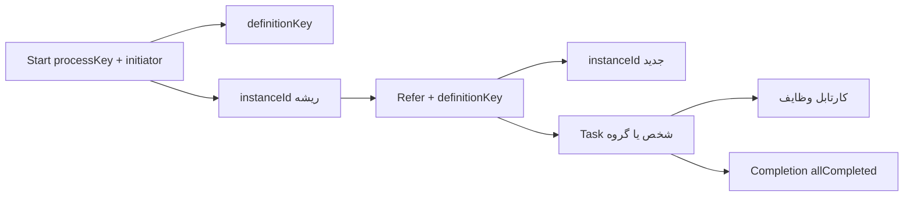
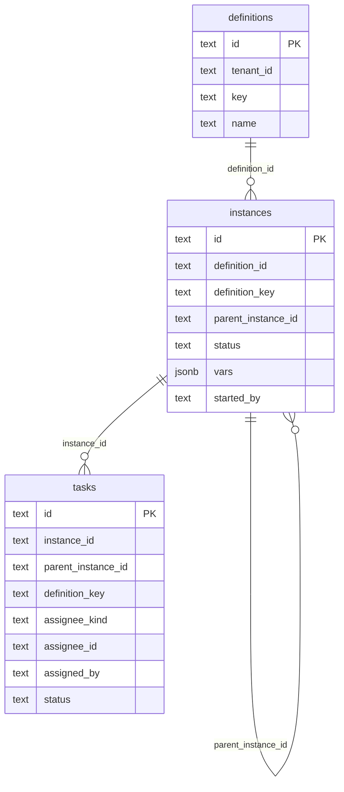

<div dir="rtl">

# معماری سیستم (Architecture)

این موتور گردش کار نیازی به مفسر پیچیدهٔ BPMN ندارد؛ بلکه بر پایهٔ مدل سرراست سه‌گانهٔ «تعریف (Definition)»، «نمونهٔ اجرا (Instance)» و «وظیفه (Task)» طراحی و پیاده‌سازی شده است.

معماری پروژه از الگوی **Clean Architecture** پیروی می‌کند؛ جهت وابستگی‌ها همواره به سمت لایه‌های درونی است و لایهٔ `Domain` هیچ وابستگی یا شناختی نسبت به دیتابیس، پروتکل HTTP، فرمت JSON یا فریم‌ورک‌های بیرونی ندارد.

---

## ۱. ساختار لایه‌بندی پروژه

<div dir="ltr">

```
WorkFlowEngine/
├── src/
│   ├── WorkflowEngine.Domain/
│   │   ├── Entities/          # Definition, ProcessInstance, WorkflowTask
│   │   ├── ValueObjects/      # AssigneeKind, TaskStatus, InstanceStatus, ProcessState
│   │   ├── Common/            # Tenant, Vars, Ids
│   │   └── Errors/            # EngineException, EngineErrorKind
│   ├── WorkflowEngine.Application/
│   │   ├── Engine.cs          # قوانین و منطق کسب‌وکار (شروع / ارجاع / تکمیل)
│   │   ├── Ports/             # رابط‌ها (IStore, IDirectory, ITenantProvider)
│   │   ├── Tenancy/           # TenantContext
│   │   └── Results/           # نتایج متدها (StartResult, ReferResult, Completion, ...)
│   ├── WorkflowEngine.Infrastructure/
│   │   ├── Persistence/       # ذخیره‌سازی داده‌ها (MemoryStore, PostgresStore)
│   │   └── Identity/          # سرویس هویت و دایرکتوری (StaticDirectory)
│   └── WorkflowEngine.Server/
│       ├── Program.cs         # ریشهٔ ترکیب وابستگی‌ها (Composition Root)
│       ├── Controllers/       # کنترلرهای وب REST
│       ├── Http/              # میان‌افزارها، پیکربندی JSON و نگاشت خطاها
│       ├── Requests/          # مدل‌های بدنهٔ درخواست ورودی
│       └── Contracts/         # DTOهای خروجی و ApiMapper
├── tests/WorkflowEngine.Tests/
├── examples/
└── docs/
```

</div>

<div dir="ltr">

```
Domain  ←  Application  ←  Infrastructure
                      ←  Server (API)
Server.Program         →  ایجاد وابستگی‌های Store / Directory / Engine
```

</div>

| پروژه | نقش و مسئولیت | لایه‌های مجاز جهت وابستگی |
|------|----------------|--------------------------|
| `WorkflowEngine.Domain` | موجودیت‌ها و خطاهای دامنه (`Definition`, `ProcessInstance`, `WorkflowTask`, `EngineException`) | بدون وابستگی به لایه‌های بیرونی |
| `WorkflowEngine.Application` | هستهٔ فرایند (`Engine` جهت مدیریت شروع، ارجاع، تکمیل، بستن فرایندها) و پورت‌ها (`IStore`, `IDirectory`) | صرفاً وابسته به `Domain` |
| `WorkflowEngine.Infrastructure` | پیاده‌سازی ذخیره‌ساز پایگاه داده (Postgres / حافظه) و دایرکتوری کاربران | وابسته به `Application` و `Domain` |
| `WorkflowEngine.Server` | رابط REST، مدیریت DTOها، Swagger و ترکیب وابستگی‌ها | وابسته به `Application` و `Infrastructure` |

<div dir="ltr">

```bash
dotnet run --project src/WorkflowEngine.Server
```

</div>

| متغیر محیطی | مقدار پیش‌فرض | توضیحات |
|-------------|---------------|----------|
| `ADDR` | `:8081` | پورت و آدرس گوش دادن به درخواست‌ها (داخل Docker `:8080`، روی سیستم میزبان `8081`) |
| `DATABASE_URL` | خالی | رشتهٔ اتصال Postgres؛ در صورت خالی بودن از حافظه موقت استفاده می‌شود |
| `WF_USERS` | خالی | فهرست کاربران در دایرکتوری ایستا |
| `WF_GROUP_<id>` | — | اعضای گروه با شناسهٔ `id` |
| `WF_API_KEYS` | در Development اختیاری | کلید مشترک درگاه؛ خارج از Development بدون آن فرآیند شروع نمی‌شود |

شناسایی کاربر در درخواست‌های REST از طریق هدر `X-Actor-Id` انجام می‌گیرد. این هدر جایگزین لاگین نیست. قفل ورودی API در پروداکشن با `WF_API_KEYS` است (هدر `X-API-Key`).

---

## ۲. مدل مفهومی گردش کار

<div dir="ltr">



</div>

| سطح | مفهوم و نقش |
|------|-------------|
| Definition | تعریف نوع فرایند با شناسهٔ یکتای `key` (بدون نیاز به دیاگرام‌های گرافیکی) |
| Instance | نمونهٔ اجرایی فرایند؛ عملیات `Start` یک اینستنس ریشه می‌سازد و هر ارجاع (`Refer`) یک اینستنس فرزند ایجاد می‌کند |
| Task | رکورد وظیفه در کارتابل؛ انتساب به کاربر (`user`) یا گروه (`group`) |

- **وضعیت اینستنس:** تا زمانی که وظایف باز داشته باشد در وضعیت `running` است؛ پس از تکمیل تمامی وظایفِ مرتبط با همان ارجاع به `completed` تغییر می‌یابد.
- **وضعیت تسک:** شامل `open` (باز)، `claimed` (تحویل‌گرفته‌شده)، `done` (تکمیل‌شده) و `cancelled` (لغوشده).

---

## ۳. پایگاه داده

در صورت تنظیم متغیر `DATABASE_URL`، کلاس `PostgresStore` اسکیما و جداول را به‌صورت خودکار ایجاد می‌کند. شرح جامع جداول، ستون‌ها، شاخص‌ها و راهنمای مهاجرت در سند [database.md](database.md) آمده است.

<div dir="ltr">



</div>

متد `Start` در صورت عدم وجود تعریف برای `processKey`، آن را به‌طور خودکار ایجاد می‌نماید. اما ارجاع (`Refer`) در صورتی که تعریف فرایند از پیش ثبت نشده باشد، با خطای عدم یافتن مواجه خواهد شد.

---

## ۴. رفتار سرویس‌ها و جریان‌های کاری

### ۱. شروع فرایند (Start)

۱. تعریف فرایند را با `processKey` بازیابی کرده یا در صورت نبود ایجاد می‌کند.  
۲. یک نمونهٔ اجرای ریشه با وضعیت `running`، ایجادکننده (`initiator`) و پارامترهای ارسالی می‌سازد.  
۳. مقادیر `{ definitionKey, instanceId }` را برمی‌گرداند. در این مرحله تسکی ساخته نمی‌شود.

### ۲. ارجاع کار (Refer)

۱. مقدار `definitionKey` اجباری است (یا در صورت عدم ارسال، از `parentInstanceId` به ارث می‌رسد).  
۲. یک نمونهٔ اجرای **جدید** ایجاد می‌کند (اگر `parentInstanceId` داده شود، به اینستنس ریشه متصل می‌گردد).  
۳. ایجاد وظیفه بر اساس نوع انتساب:
   - `user`: ایجاد یک تسک اختصاصی برای شخص مشخص‌شده.
   - `group`: ایجاد یک تسک گروهی؛ کلیهٔ اعضای گروه در کارتابل آن را مشاهده کرده و هر عضو پس از تحویل (Claim) می‌تواند آن را تکمیل کند.
   - `users`: ایجاد یک تسک مجزا به‌ازای هر شناسه، همگی ذیل یک اینستنس ارجاع یکسان.  
۴. پاسخ خروجی شامل `{ instanceId, task, tasks }` خواهد بود.

### ۳. کارتابل وظایف باز (Pending Tasks)

- استعلام کاربر (`user`): تسک‌های باز (`open`) منتسب به کاربر یا گروه‌هایی که کاربر در آن‌ها عضویت دارد (`Directory.UserGroups`).
- استعلام گروه (`group`): تسک‌های باز گروهی با شناسهٔ همان گروه (`assignee_kind = group`).

### ۴. تکمیل وظایف (Completion)

محاسبه بر روی `instanceId` ارجاع انجام می‌شود. شاخص `allCompleted` زمانی برابر `true` خواهد بود که حداقل یک تسک وجود داشته و هیچ تسکی در وضعیت `open` یا `claimed` باقی نمانده باشد.

- تکمیل تسک شخصی صرفاً توسط همان فرد امکان‌پذیر است.
- تکمیل تسک گروهی تنها توسط عضوی که تسک را تحویل گرفته (Claim کرده) مجاز است.

### ۵. تکمیل و بستن کل فرایند (Complete and End)

متد `CompleteAndEnd` وظیفهٔ جاری را تکمیل کرده، سایر وظایف باز باقی‌مانده در کل درخت فرایند را به وضعیت `cancelled` منتقل می‌کند و اینستنس ریشه و فرزندان را در وضعیت `completed` قرار می‌دهد.

### ۶. فرایندهای کاربر (User Processes)

متد `ListUserProcesses(user, state?)` فهرست نمونه‌های ریشه‌ای که توسط کاربر آغاز شده‌اند را برمی‌گرداند:

- `notStarted`: آغاز شده اما هنوز هیچ ارجاعی برای آن ثبت نشده است.
- `open`: دارای تسک باز بوده و ریشه همچنان در وضعیت `running` قرار دارد.
- `closed`: پرونده با وضعیت `completed` بسته شده است.

---

## ۵. مدیریت همزمانی و تراکنش‌ها

متد `TransitionTask` در پیاده‌سازی Postgres از دستور `SELECT ... FOR UPDATE` درون یک تراکنش مجزا بهره می‌برد. بدین ترتیب در صورتی که دو درخواست هم‌زمان برای تکمیل یک تسک ارسال شوند، یکی از آن‌ها موفق بوده و دیگری با خطای `NotOpen` مواجه خواهد شد.

</div>
