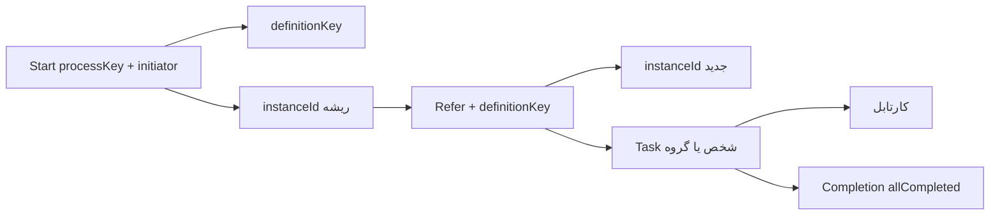
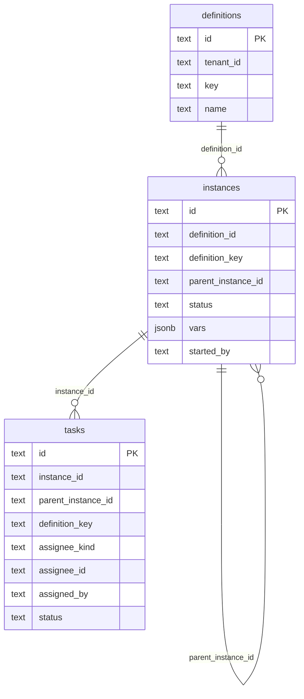

<div dir="rtl">

# معماری

این انجین گراف BPMN تفسیر نمی‌کند. سرویس‌ها روی یک مدل سادهٔ تعریف / اینستنس / تسک سوار است.

ساختار **Clean Architecture** است: وابستگی به داخل است. Domain هیچ ارجاعی به دیتابیس، HTTP یا JSON ندارد.

---

## ۱. ساختار پروژه

<div dir="ltr">

```
WorkFlowEngine/
├── src/
│   ├── WorkflowEngine.Domain/
│   │   ├── Entities/          # Definition, ProcessInstance, WorkflowTask
│   │   ├── ValueObjects/      # AssigneeKind, TaskStatus, InstanceStatus, ProcessState
│   │   ├── Common/            # Tenant, Vars, Ids
│   │   └── Errors/            # EngineException, EngineErrorKind
│   ├── WorkflowEngine.Application/
│   │   ├── Engine.cs          # قوانین شروع / ارجاع / تکمیل
│   │   ├── Ports/             # IStore, IDirectory, ITenantProvider
│   │   ├── Tenancy/           # TenantContext
│   │   └── Results/           # StartResult, ReferResult, Completion, ...
│   ├── WorkflowEngine.Infrastructure/
│   │   ├── Persistence/       # MemoryStore, PostgresStore
│   │   └── Identity/          # StaticDirectory
│   └── WorkflowEngine.Server/
│       ├── Program.cs         # composition root
│       ├── Controllers/       # کنترلرهای REST
│       ├── Http/              # middleware، JSON، خطا
│       ├── Requests/          # بدنهٔ ورودی REST
│       └── Contracts/         # DTO خروجی + ApiMapper
├── tests/WorkflowEngine.Tests/
├── examples/
└── docs/
```

</div>

<div dir="ltr">

```
Domain  ←  Application  ←  Infrastructure
                      ←  Server (API)
Server.Program         →  می‌سازد Store/Directory/Engine
```

</div>

| پروژه | نقش | اجازه دارد بداند |
|------|------|------------------|
| `WorkflowEngine.Domain` | `Definition`, `ProcessInstance`, `WorkflowTask`, `EngineException` | هیچ لایهٔ بیرونی |
| `WorkflowEngine.Application` | `Engine` (شروع، ارجاع، تکمیل، پایان، فرایندهای کاربر)، `IStore`, `IDirectory` | فقط Domain |
| `WorkflowEngine.Infrastructure` | Postgres / حافظه / دایرکتوری استاتیک | Application + Domain |
| `WorkflowEngine.Server` | REST، DTO، Swagger، ترکیب وابستگی‌ها | Application + Infrastructure |

<div dir="ltr">

```bash
dotnet run --project src/WorkflowEngine.Server
```

</div>

| متغیر | پیش‌فرض | معنی |
|--------|---------|------|
| `ADDR` | `:8081` | آدرس listen (داخل Docker `:8080`، روی میزبان `8081`) |
| `DATABASE_URL` | خالی | Postgres؛ وگرنه حافظه |
| `WF_USERS` | خالی | کاربران دایرکتوری استاتیک |
| `WF_GROUP_<id>` | — | اعضای گروه `id` |

هویت REST از `X-Actor-Id` است.

---

## ۲. مدل مفهومی

<div dir="ltr">



</div>

| سطح | چیست |
|------|------|
| Definition | نوع فرایند با `key` (بدون گراف) |
| Instance | یک اجرا. start یک اینستنس ریشه می‌سازد؛ هر ارجاع اینستنس فرزند می‌سازد |
| Task | کارتابل. `assigneeKind` = `user` یا `group` |

وضعیت اینستنس: `running` تا وقتی تسک باز دارد؛ بعد از تکمیل همهٔ تسک‌های همان اینستنس ارجاع → `completed`.

وضعیت تسک: `open` | `claimed` | `done` | `cancelled`.

---

## ۳. دیتابیس

اگر `DATABASE_URL` ست باشد `PostgresStore` اسکیما را می‌سازد. شرح کامل جداول، ستون‌ها، ایندکس‌ها و مهاجرت: [database.md](database.md).

<div dir="ltr">



</div>

`Start` اگر تعریفی برای `processKey` نباشد آن را می‌سازد. ارجاع بدون تعریف موجود خطا می‌دهد.

---

## ۴. رفتار سرویس‌ها

### Start

1. تعریف را با `processKey` پیدا یا ایجاد می‌کند.
2. اینستنس `running` با `initiator` و `parameters` می‌سازد.
3. `{ definitionKey, instanceId }` برمی‌گرداند. تسکی ساخته نمی‌شود.

### Refer

1. `definitionKey` اجباری است (یا از `parentInstanceId` ارث می‌برد).
2. اینستنس **جدید** می‌سازد (`parent_instance_id` = اینستنس start اگر داده شده).
3. تسک:
   - `user` → یک تسک برای آن شخص
   - `group` → یک تسک گروهی؛ اعضا در Inbox می‌بینند؛ هر عضو می‌تواند complete کند
   - `users` → یک تسک به‌ازای هر id، همه روی همان اینستنس ارجاع
4. `{ instanceId, task, tasks }` برمی‌گرداند.

### Pending tasks

- `user`: تسک `open` با `assignee_id = user` یا گروههایی که `Directory.UserGroups` برمی‌گرداند
- `group`: تسک `open` با `assignee_kind=group` و همان شناسه

### Completion

روی `instanceId` ارجاع. `allCompleted` وقتی true است که حداقل یک تسک باشد و هیچ‌کدام `open` نمانده باشد. همان ساختار در خروجی `CompleteTask` هم هست.

تکمیل تسک شخصی فقط توسط همان شخص؛ تسک گروهی توسط عضو گروه.

### Complete and end

`CompleteAndEnd` تسک را complete می‌کند، تسک‌های باز باقی‌ماندهٔ درخت را `cancelled` می‌کند، و ریشه را `completed` می‌گذارد.

### فرایندهای کاربر

`ListUserProcesses(user, state?)` اینستنس‌های start با `initiator = user`:

- `notStarted`: بدون تسک
- `open`: `running` و حداقل یک تسک
- `closed`: `completed`

---

## ۵. همزمانی

`TransitionTask` در Postgres با `SELECT ... FOR UPDATE` است. دو complete همزمان روی یک تسک یکی `ErrNotOpen` می‌گیرد.

</div>
