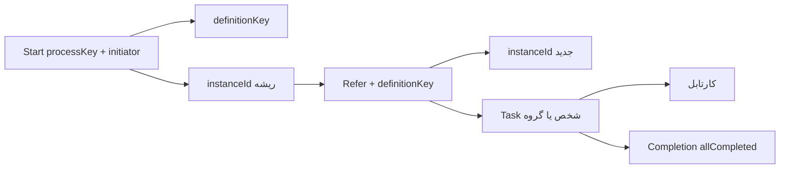
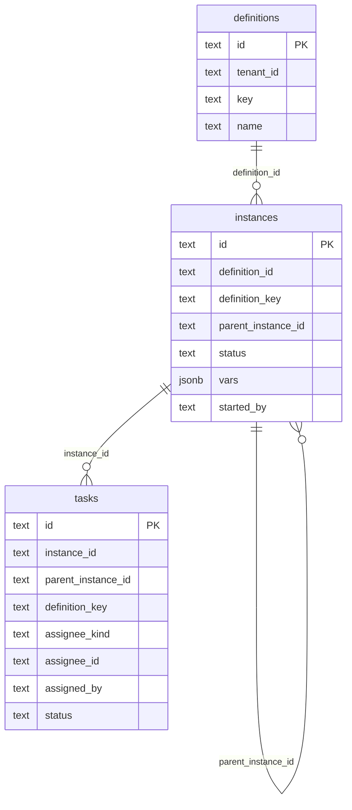

# معماری سرویس‌بیس

ماژول Go: `github.com/mortenaho/workflowengine`.

این انجین گراف BPMN تفسیر نمی‌کند. چهار سرویس روی یک مدل سادهٔ تعریف / اینستنس / تسک سوار است.

---

## ۱. ساختار پروژه

```
WorkFlowEngine/
├── cmd/server/main.go
├── examples/curl.sh
├── docs/
│   ├── usage.md
│   └── architecture.md
├── pkg/workflow/          # SDK عمومی
├── internal/
│   ├── domain/
│   ├── engine/            # منطق سرویس‌ها
│   ├── identity/          # Directory کاربر/گروه
│   ├── store/             # memory + postgres
│   └── api/http/          # REST + Swagger
```

```
cmd/server  →  pkg/workflow + internal/api/http + internal/store/postgres
pkg/workflow  →  internal/engine + internal/domain + internal/store + internal/identity
internal/engine  →  domain, store, identity
internal/api/http  →  pkg/workflow
```

| پکیج | نقش |
|------|------|
| `pkg/workflow` | SDK: `Start`, `Refer`, `PendingTasks`, `CompleteTask`, `Completion` |
| `internal/engine` | قوانین شروع، ارجاع، مجوز تکمیل |
| `internal/domain` | `Definition`, `ProcessInstance`, `Task` |
| `internal/store` | persistence |
| `internal/identity` | `Directory`؛ انجین مالک HR نیست |
| `internal/api/http` | REST |

```bash
go run ./cmd/server
```

| متغیر | پیش‌فرض | معنی |
|--------|---------|------|
| `ADDR` | `:8081` | آدرس listen (داخل Docker `:8080`، روی میزبان `8081`) |
| `DATABASE_URL` | خالی | Postgres؛ وگرنه حافظه |
| `WF_USERS` | `alice,bob,cara,dan,manager,ceo` | کاربران |
| `WF_GROUP_LEGAL` | `bob,cara` | اعضای `legal` |
| `WF_GROUP_FINANCE` | `dan,cara` | اعضای `finance` |

هویت REST از `X-Actor-Id` است.

---

## ۲. مدل مفهومی



| سطح | چیست |
|------|------|
| Definition | نوع فرایند با `key` (بدون گراف) |
| Instance | یک اجرا. start یک اینستنس ریشه می‌سازد؛ هر ارجاع اینستنس فرزند می‌سازد |
| Task | کارتابل. `assigneeKind` = `user` یا `group` |

وضعیت اینستنس: `running` تا وقتی تسک باز دارد؛ بعد از تکمیل همهٔ تسک‌های همان اینستنس ارجاع → `completed`.

وضعیت تسک: `open` | `done`.

---

## ۳. دیتابیس

اگر `DATABASE_URL` ست باشد `internal/store/postgres` اسکیما را می‌سازد.



`Start` اگر تعریفی برای `processKey` نباشد آن را می‌سازد. ارجاع بدون تعریف موجود خطا می‌دهد.

---

## ۴. رفتار سرویس‌ها

### Start

1. تعریف را با `processKey` پیدا یا ایجاد می‌کند.
2. اینستنس `running` با `initiator` و `parameters` می‌سازد.
3. `{ definitionKey, instanceId }` برمی‌گرداند. تسکی ساخته نمی‌شود.

### Refer

1. `definitionKey` اجباری است (یا از `parentInstanceId` ارث می‌برد).
2. اینستنس **جدید** می‌سازد (`parent_instance_id` = اینستنس start اگر داده شده).
3. تسک:
   - `user` → یک تسک برای آن شخص
   - `group` → یک تسک گروهی؛ اعضا در Inbox می‌بینند؛ هر عضو می‌تواند complete کند
   - `users` → یک تسک به‌ازای هر id، همه روی همان اینستنس ارجاع
4. `{ instanceId, task, tasks }` برمی‌گرداند.

### Pending tasks

- `user`: تسک `open` با `assignee_id = user` یا گروههایی که `Directory.UserGroups` برمی‌گرداند
- `group`: تسک `open` با `assignee_kind=group` و همان شناسه

### Completion

روی `instanceId` ارجاع. `allCompleted` وقتی true است که حداقل یک تسک باشد و هیچ‌کدام `open` نمانده باشد. همان ساختار در خروجی `CompleteTask` هم هست.

تکمیل تسک شخصی فقط توسط همان شخص؛ تسک گروهی توسط عضو گروه.

---

## ۵. همزمانی

`TransitionTask` در Postgres با `SELECT ... FOR UPDATE` است. دو complete همزمان روی یک تسک یکی `ErrNotOpen` می‌گیرد.
