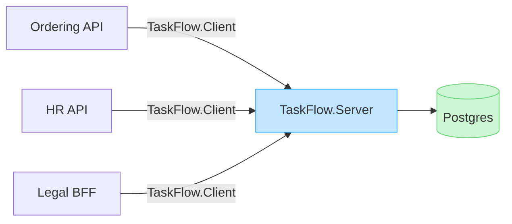
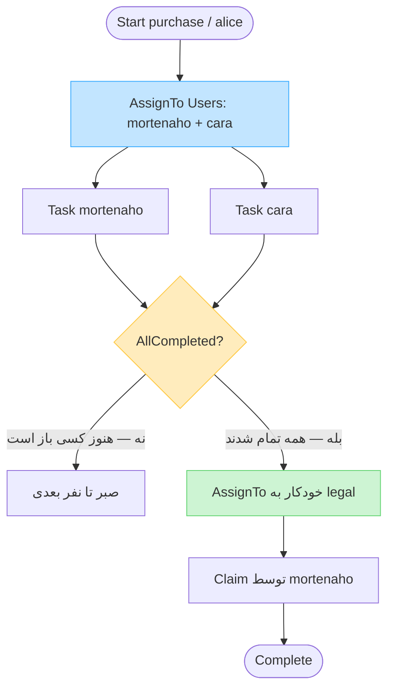
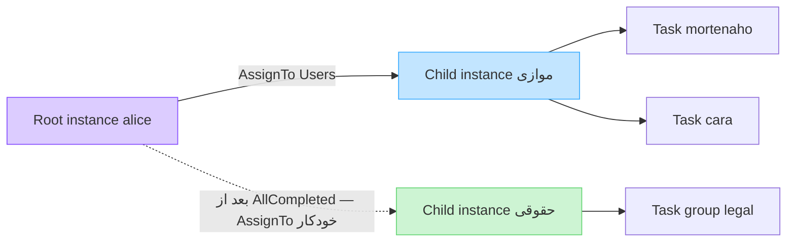
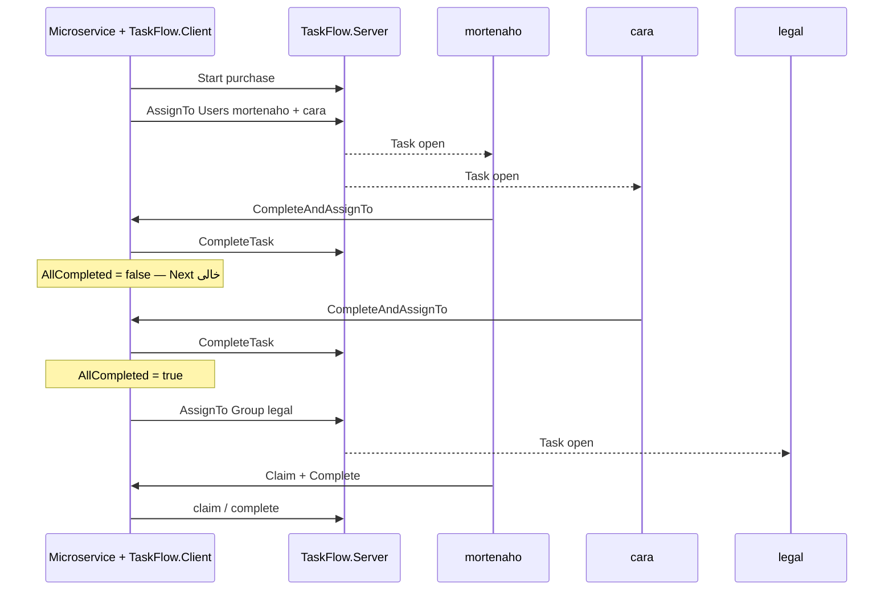

<div dir="rtl">

# راهنمای استفاده (Usage Guide)

قابلیت‌های کلیدی موتور گردش کار:

۱. شروع فرایند جدید  
۲. فهرست‌گیری از اجراهای یک فرایند (`processKey`)  
۳. ارجاع کار به کاربر، گروه، یا چند نفر هم‌زمان  
۴. کارتابل وظایف باز  
۵. بررسی وضعیت تکمیل ارجاع‌های چندنفره  
۶. تکمیل وظیفه و بستن کامل پرونده  
۷. دریافت آمار و فهرست فرایندهای مرتبط با یک کاربر  
۸. رفتن خودکار به مرحله بعد با `ProcessOrchestrator` (بعد از `allCompleted`)  

<div dir="ltr">

```bash
dotnet run --project src/TaskFlow.Server
```

</div>

مستندات تعاملی Swagger: http://127.0.0.1:8081/swagger

| عملیات | نحوهٔ فراخوانی (REST API) |
|--------|---------------------------|
| شروع فرایند | `POST /v1/processes/start` با بدنهٔ `{ "processKey", "initiator", "parameters?" }` |
| لیست اجراها | `GET /v1/processes/{processKey}/instances` |
| ارجاع کار | `POST /v1/assignments` با بدنهٔ `{ "definitionKey", "parentInstanceId?", "to" }` |
| کارتابل وظایف | `GET /v1/tasks?user=mortenaho` یا `GET /v1/tasks?group=legal` |
| تحویل گرفتن تسک (Claim) | `POST /v1/tasks/{id}/claim` |
| لغو تحویل تسک (Unclaim) | `POST /v1/tasks/{id}/unclaim` |
| وضعیت تکمیل چندنفره | `GET /v1/instances/{id}/completion` |
| تکمیل وظیفه | `POST /v1/tasks/{id}/complete` |
| تکمیل و پایان فرایند | `POST /v1/tasks/{id}/complete-and-end` |
| فرایندهای کاربر | `GET /v1/users/{user}/processes` با فیلتر اختیاری `state=open`، `closed` یا `notStarted` |

برای میکروسرویس‌ها مسیر پیشنهادی **SDK کلاینت** (`TaskFlow.Client`) است: یک بار `TaskFlow.Server` را بالا می‌آورید و هر سرویس فقط با HTTP به همان آدرس وصل می‌شود. در تست‌های واحد یا وقتی خودتان میزبان انجین هستید، می‌توانید `Engine` را داخل‌پردازشی هم بسازید. نمونهٔ `curl`: [`examples/curl.sh`](https://github.com/mortenaho/WorkFlowEngine/blob/main/examples/curl.sh).

---

## ۱. مفاهیم پایه

| واژه | توضیحات و مفهوم |
|------|-----------------|
| `processKey` | کلید شناسهٔ نوع فرایند (مانند `purchase` یا `employeeTermination`) |
| `definitionKey` | کلید تعریف ثبت‌شده برای فرایند که در خروجی متد شروع بازگردانده می‌شود |
| `instanceId` | شناسهٔ یک نمونهٔ اجرایی؛ فراخوانی `Start` نمونهٔ ریشه را می‌سازد و هر ارجاع (`AssignTo`) یک نمونهٔ جدید ایجاد می‌کند |
| `Task` | رکورد وظیفه در کارتابل که به یک کاربر یا یک گروه تخصیص یافته است |
| `Inbox` / `Tasks` | وظایف در وضعیت باز (`open`) متعلق به یک کاربر (شامل وظایف فردی و گروه‌های عضو) یا یک گروه |

شناسهٔ انجام‌دهندهٔ عملیات از طریق هدر `X-Actor-Id` ارسال می‌گردد. این مقدار برای انجین یک شناسهٔ مات (opaque) است — مثلاً `102` به‌عنوان شناسهٔ کاربر در سامانهٔ خودتان. انجین جدول کاربران ندارد و لاگین نمی‌کند؛ فقط همان رشته را در تسک‌ها ذخیره و با آن مجوز عملیات را می‌سنجد.

اگر `WF_USERS` و `WF_GROUP_*` تنظیم نشوند، سرویس به‌صورت پیش‌فرض از `OpenDirectory` استفاده می‌کند: هر شناسهٔ کاربر یا گروه پذیرفته می‌شود و عضویت گروه اجباری نیست. وقتی فهرست کاربران/گروه‌ها را تعریف کنید، `StaticDirectory` فعال می‌شود و ارجاع به گروه خالی یا ادعای عضویت نادرست رد می‌گردد. در پروداکشن می‌توانید به‌جای آن‌ها `IDirectory` را به SSO / LDAP وصل کنید.

---

## ۲. استفاده از طریق SDK در زبان C#‎

هدف این بخش: **یک `TaskFlow.Server` از قبل بالا آمده** (مثلاً در Docker یا کلاستر) و چند میکروسرویس که هر کدام فقط پکیج `TaskFlow.Client` را دارند و به همان آدرس HTTP وصل می‌شوند. انجین، دیتابیس و `IDirectory` روی سرور می‌مانند؛ کلاینت‌ها `Engine` یا Postgres را داخل سرویس خودشان نمی‌سازند.

<div dir="ltr">



</div>

### پیش‌نیاز: سرور مشترک

<div dir="ltr">

```bash
dotnet run --project src/TaskFlow.Server
# یا: docker compose up --build
# Base URL پیش‌فرض: http://127.0.0.1:8081
```

</div>

در پروداکشن روی سرور `WF_API_KEYS` را تنظیم کنید؛ هر میکروسرویس همان کلید را فقط در env بک‌اند خودش نگه می‌دارد و به‌صورت `X-API-Key` می‌فرستد (نه در مرورگر).

### افزودن پکیج به میکروسرویس

<div dir="ltr">

```xml
<ItemGroup>
  <ProjectReference Include="..\..\path\to\TaskFlow.Client\TaskFlow.Client.csproj" />
  <!-- یا پس از انتشار: <PackageReference Include="TaskFlow.Client" Version="..." /> -->
</ItemGroup>
```

</div>

### ثبت در `Program.cs` هر میکروسرویس

<div dir="ltr">

```csharp
using TaskFlow.Client;

builder.Services.AddTaskFlowClient(o =>
{
    o.BaseAddress = new Uri(builder.Configuration["TaskFlow:BaseUrl"]
        ?? "http://taskflow:8081/");
    o.ApiKey = builder.Configuration["TaskFlow:ApiKey"];   // همان WF_API_KEYS سرور
    o.TenantId = builder.Configuration["TaskFlow:TenantId"]; // اختیاری؛ مثلاً acme
});

// بعداً در کنترلر / هندلر:
// private readonly TaskFlowClient _tf;
// private readonly TaskFlowOrchestrator _orch;
```

</div>

بدون DI هم می‌توانید بسازید:

<div dir="ltr">

```csharp
using TaskFlow.Client;

var http = new HttpClient { BaseAddress = new Uri("http://127.0.0.1:8081/") };
var tf = new TaskFlowClient(http, new TaskFlowClientOptions
{
    ApiKey = Environment.GetEnvironmentVariable("TASKFLOW_API_KEY"),
    TenantId = "default",
});
await tf.EnsureHealthy();
```

</div>

### شروع فرایند

خروجی شامل `DefinitionKey` و `InstanceId` است. هدر `X-Actor-Id` را SDK از آرگومان `initiator` / `actor` می‌گذارد.

<div dir="ltr">

```csharp
using TaskFlow.Application;
using TaskFlow.Client;

var started = await tf.Start(
    "purchase",
    "alice",
    new Dictionary<string, object?> { ["amount"] = 1.5e8 });
```

</div>

### ارجاع به کاربر یا گروه

`ToKind` می‌تواند `user`، `group` یا `users` باشد (`AssigneeKind`). برای حالت چندنفره از `ToIds` استفاده کنید.

<div dir="ltr">

```csharp
using TaskFlow.Domain;

var refer = await tf.AssignTo("alice", new AssignToInput
{
    DefinitionKey = started.DefinitionKey,
    ParentInstanceId = started.InstanceId,
    Title = "Legal review",
    ToKind = AssigneeKind.User,
    ToId = "mortenaho",
    // ToIds = ["mortenaho", "cara"],  // AssigneeKind.Users
});
```

</div>

### تخصیص موازی و رفتن خودکار به مرحله بعد

موتور خودش «مرحلهٔ بعد» را بلد نیست؛ فقط ارجاع می‌سازد و با `allCompleted` می‌گوید آیا آن ارجاع تمام شده یا نه. روی کلاینت از `TaskFlowOrchestrator` استفاده کنید (معادل HTTPیِ `ProcessOrchestrator`).

**به زبان ساده:**

1. با `AssignTo` و `Users` کار را هم‌زمان به چند نفر بفرست.  
2. هر نفر تسک خودش را با `CompleteAndAssignTo` تمام می‌کند.  
3. تا وقتی همه تمام نکرده‌اند، هیچ ارجاع جدیدی ساخته نمی‌شود.  
4. وقتی آخرین نفر تمام کرد (`allCompleted = true`)، اورکستریتور همان لحظه `AssignTo` بعدی را روی سرور می‌زند.

#### تصویر کلی جریان

<div dir="ltr">



</div>

#### چه چیزی کجا ساخته می‌شود؟

<div dir="ltr">



</div>

- ریشه (`Start`) پرونده را نگه می‌دارد.  
- هر `AssignTo` یک فرزند جدید می‌سازد؛ تسک‌ها زیر همان فرزند می‌نشینند.  
- `AllCompleted` فقط برای **همان فرزند** حساب می‌شود، نه کل پرونده.  
- ارجاع بعدی دوباره به همان ریشه وصل می‌شود (`ParentInstanceId`).

#### ترتیب زمانی (میکروسرویس ↔ سرور مشترک)

<div dir="ltr">



</div>

#### نمونه کد

اگر `DefinitionKey` یا `ParentInstanceId` را خالی بگذارید، اورکستریتور از تسکِ تکمیل‌شده پرشان می‌کند. ارجاع بعدی به‌نام `AssignedBy` همان مرحله (مثلاً `alice`) زده می‌شود.

<div dir="ltr">

```csharp
var orch = new TaskFlowOrchestrator(tf);

var parallel = await tf.AssignTo("alice", new AssignToInput
{
    DefinitionKey = started.DefinitionKey,
    ParentInstanceId = started.InstanceId,
    Title = "تأیید موازی",
    ToKind = AssigneeKind.Users,
    ToIds = ["mortenaho", "cara"],
});

AssignToResult? legal = null;
foreach (var task in parallel.Tasks)
{
    var advanced = await orch.CompleteAndAssignTo(
        task.Id,
        task.AssigneeId,
        "تأیید شد",
        _ => new AssignToInput
        {
            Title = "بررسی حقوقی",
            ToKind = AssigneeKind.Group,
            ToId = "legal",
        });

    // فقط وقتی آخرین نفر تمام کند، Next پر می‌شود
    if (advanced.Next is not null)
        legal = advanced.Next;
}
```

</div>

#### نمونه BFF: یک endpoint برای همهٔ تسک‌های موازی

در پروداکشن کاربر مستقیم TaskFlow را صدا نمی‌زند. UI دکمه «تأیید» را می‌زند؛ **BFF شما** همان `CompleteAndAssignTo` را با قانون مرحلهٔ بعد صدا می‌کند.

اگر پنج نفر موازی دارید، **پنج endpoint جدا لازم نیست** — همه از یک مسیر با `taskId` متفاوت استفاده می‌کنند:

<div dir="ltr">

```http
POST /api/tasks/task-1/approve   ← mortenaho
POST /api/tasks/task-2/approve   ← cara
POST /api/tasks/task-3/approve   ← dan
...
```

</div>

همان handler، همان callback «مرحله بعد»؛ فقط وقتی **آخرین** نفر complete کرد `Next` پر می‌شود.

<div dir="ltr">

```csharp
using TaskFlow.Application;
using TaskFlow.Client;
using TaskFlow.Domain;
using Microsoft.AspNetCore.Mvc;

[ApiController]
[Route("api")]
public sealed class TaskApprovalController : ControllerBase
{
    private readonly TaskFlowOrchestrator _orch;

    public TaskApprovalController(TaskFlowOrchestrator orch) => _orch = orch;

    public sealed class ApproveRequest
    {
        public string? Note { get; set; }
    }

    [HttpPost("tasks/{taskId}/approve")]
    public async Task<IActionResult> Approve(string taskId, [FromBody] ApproveRequest body)
    {
        var userId = User.FindFirst("sub")?.Value ?? ""; // از SSO

        var result = await _orch.CompleteAndAssignTo(
            taskId,
            userId,
            body.Note ?? "تأیید شد",
            NextStepAfterParallelReview); // ← یک بار تعریف شده

        if (result.Next is not null)
            return Ok(new { status = "all_done", next = result.Next });

        return Ok(new { status = "waiting_for_others" });
    }

    // قانون مرحله بعد — یک جا
    private static AssignToInput NextStepAfterParallelReview(CompleteResult _) =>
        new()
        {
            Title = "بررسی حقوقی",
            ToKind = AssigneeKind.Group,
            ToId = "legal",
        };
}
```

</div>

| complete توسط | `AllCompleted` | پاسخ BFF |
|---------------|----------------|----------|
| نفر ۱ از ۵ | `false` | `{ status: "waiting_for_others" }` |
| نفر ۲ تا ۴ | `false` | همان |
| نفر ۵ (آخر) | `true` | `{ status: "all_done", next: … legal }` |

ثبت `TaskFlowOrchestrator` در `Program.cs` میکروسرویس:

<div dir="ltr">

```csharp
builder.Services.AddTaskFlowClient(o =>
{
    o.BaseAddress = new Uri("http://taskflow:8080/");
    o.ApiKey = builder.Configuration["TaskFlow:ApiKey"];
});
// AddTaskFlowClient خودش TaskFlowOrchestrator را هم register می‌کند
```

</div>

نمونهٔ دامنهٔ in-process (بدون HTTP): [`examples/Scenario`](../examples/Scenario/Program.cs). تست یکپارچهٔ SDK: `ClientSdkTests`.

| مفهوم | معنی کوتاه |
|--------|------------|
| `Users` + `ToIds` | چند تسک موازی؛ **همه** باید تمام شوند |
| `Group` + `ToId` | یک تسک مشترک؛ یکی Claim می‌کند |
| `CompleteTask` | فقط همین تسک را می‌بندد |
| `CompleteAndAssignTo` | همان + در صورت `AllCompleted`، `AssignTo` بعدی |
| `advanced.Next` | ارجاع تازه؛ تا قبل از join برابر `null` است |

### کارتابل، تکمیل، و فرایندهای کاربر

<div dir="ltr">

```csharp
var inbox = await tf.PendingTasks(user: "mortenaho");
var groupInbox = await tf.PendingTasks(group: "legal");

var ended = await tf.CompleteAndEnd(refer.Task!.Id, "mortenaho", "Case closed");
// ended.Process.Status == "completed"

var mine = await tf.ListUserProcesses("alice");
var open = await tf.ListUserProcesses("alice", state: "open");
```

</div>

سایر متدهای مهم SDK: `ClaimTask` / `UnclaimTask`، `Completion(instanceId)`، `ListByProcessKey`، `GetInstance`، `RegisterDefinition`.

### چند سرویس، یک tenant یا چند tenant

| سناریو | تنظیم |
|--------|--------|
| همهٔ میکروسرویس‌ها یک سازمان | `TenantId` را خالی بگذارید یا همه `default` |
| جداسازی داده بین مشتری‌ها | در هر سرویس `o.TenantId = "acme"` یا در هر فراخوانی آرگومان `tenantId` |
| محیط امن | همان `ApiKey` مشترک بک‌اندها؛ React کلید را نمی‌بیند |

### حالت توکار (فقط وقتی خودتان سرور را می‌سازید)

اگر می‌خواهید در تست یا یک باینری واحد، انجین را **داخل همان پروسس** داشته باشید (نه اتصال به سرور ریموت)، هنوز می‌توانید `Engine` + `MemoryStore`/`PostgresStore` بسازید. دایرکتوری کاربران (`IDirectory`) فقط روی **میزبان سرور** معنی دارد، نه روی میکروسرویس کلاینت:

<div dir="ltr">

```csharp
using TaskFlow.Application;
using TaskFlow.Infrastructure;

var dir = new StaticDirectory(
    ["alice", "mortenaho", "cara", "dan"],
    new Dictionary<string, IReadOnlyList<string>>
    {
        ["legal"] = ["mortenaho", "cara"],
        ["finance"] = ["dan", "cara"],
    });
var eng = new Engine(new MemoryStore(), dir);
var orch = new ProcessOrchestrator(eng);
```

</div>

برای اتصال سرور به SSO / LDAP، `IDirectory` را روی همان پروسس `TaskFlow.Server` پیاده کنید (نه داخل هر میکروسرویس). نمونهٔ رابط:

<div dir="ltr">

```csharp
public interface IDirectory
{
    bool EnforcesMembership { get; }
    Task<bool> UserExists(string userId, CancellationToken cancellationToken = default);
    Task<IReadOnlyList<string>> GroupMembers(string groupId, CancellationToken cancellationToken = default);
    Task<IReadOnlyList<string>> UserGroups(string userId, CancellationToken cancellationToken = default);
    Task<bool> IsMember(string userId, string groupId, CancellationToken cancellationToken = default);
}
```

</div>

جزئیات معماری کلید API و BFF: [architecture.md](architecture.md#api-key-architecture).

---

## ۳. راهنمای وب‌سرویس REST API

آدرس پایه: `http://localhost:8081`.  
هدرهای اصلی:
- `X-Actor-Id`: شناسهٔ کاربر انجام‌دهندهٔ درخواست (اجباری در اکثر عملیات). این هدر لاگین نیست و انجین توکن صادر نمی‌کند.
- `X-Tenant-Id`: شناسهٔ سازمان جهت جداسازی داده‌ها (اختیاری؛ پیش‌فرض: `default`).
- `X-API-Key`: کلید مشترک سرویس برای بک‌اند یا API Gateway. در پروداکشن اجباری است (متغیر `WF_API_KEYS`). مسیرهای `/health` و مستندات مستثنی هستند.

<a id="react-bff"></a>

### اتصال از React: کلید را در مرورگر نفرستید

`X-API-Key` برای `curl`، تست، و **بک‌اند شما** است، نه برای `fetch` در React. اگر فرانت کلید را در هدر بگذارد، در Network مرورگر لو می‌رود. معماری پیشنهادی و دیاگرام‌ها: [architecture.md — بخش ۶](architecture.md#api-key-architecture).

**React (فقط API خودتان، بدون کلید انجین):**

فراخوانی مستقیم انجین از مرورگر با `X-API-Key` اشتباه است — کلید در Network لو می‌رود.

<div dir="ltr">

```js
await fetch("/api/inbox", { credentials: "include" });
```

</div>

**بک‌اند / BFF (این‌جا کلید از env خوانده می‌شود):**

`userId` از جلسهٔ لاگین اپ شما می‌آید، نه از query مرورگر. نمونهٔ Express؛ معادل آن در ASP.NET / Nest یکسان است.

<div dir="ltr">

```js
app.get("/api/inbox", async (req, res) => {
  const userId = req.session.userId;
  const r = await fetch(`${process.env.TASKFLOW_URL}/v1/tasks?user=${encodeURIComponent(userId)}`, {
    headers: {
      "X-API-Key": process.env.WF_API_KEYS.split(",")[0],
      "X-Actor-Id": userId,
    },
  });
  res.status(r.status).json(await r.json());
});
```

</div>

فلو خلاصه: کاربر در اپ شما لاگین می‌کند → React به `/api/...` همان اپ درخواست می‌زند → بک‌اند جلسه را چک می‌کند → با `X-API-Key` و `X-Actor-Id` به انجین می‌زند → پاسخ را به React برمی‌گرداند.

### ۱. شروع فرایند (Start)

<div dir="ltr">

```json
POST /v1/processes/start
{ "processKey": "purchase", "initiator": "alice", "parameters": { "amount": 150000000 } }

→ { "definitionKey": "purchase", "instanceId": "..." }
```

</div>

در صورت خالی بودن فیلد `initiator`، مقدار هدر `X-Actor-Id` جایگزین می‌شود. اگر برای `processKey` تعریفی وجود نداشته باشد، به‌صورت خودکار ساخته می‌شود.

یک `processKey` می‌تواند بارها شروع شود (برای نمونه فرایند `employeeTermination` برای هر کارمند به‌طور مستقل اجرا می‌گردد):

<div dir="ltr">

```bash
GET /v1/processes/employeeTermination/instances
```

</div>

<div dir="ltr">

```json
{
  "processKey": "employeeTermination",
  "total": 2,
  "instances": [
    {
      "instanceId": "...",
      "initiator": "hr",
      "status": "running",
      "parameters": { "employeeId": "1002" },
      "tasks": [ ... ],
      "taskTotal": 1,
      "tasksOpen": 1,
      "allTasksCompleted": false
    }
  ]
}
```

</div>

فهرست فوق فقط نمونه‌های ریشه (Start) را بازمی‌گرداند؛ وظایف مربوط به ارجاع‌های فرزند نیز در فیلد `tasks` همان نمونه لیست می‌شوند.

### ۲. ارجاع کار (Assignment)

`parentInstanceId` همان `instanceId` دریافتی از پاسخ Start است.

<div dir="ltr">

```json
POST /v1/assignments
{
  "definitionKey": "purchase",
  "parentInstanceId": "<instanceId from start>",
  "from": "alice",
  "title": "Review",
  "to": { "kind": "user", "id": "mortenaho" }
}

→ { "instanceId": "...", "definitionKey": "purchase", "task": { ... }, "tasks": [ ... ] }
```

</div>

در صورت خالی بودن فیلد `from`، مقدار هدر `X-Actor-Id` درج می‌شود.

| مقدار `to.kind` | فیلدهای مورد نیاز | نتیجه |
|-----------------|-------------------|--------|
| `user` | `id` | ایجاد یک تسک اختصاصی برای همان کاربر |
| `group` | `id` | ایجاد یک تسک گروهی؛ کلیهٔ اعضای گروه آن را در کارتابل مشاهده می‌کنند |
| `users` | `ids` | ایجاد یک تسک مجزا به‌ازای هر کاربر؛ وضعیت تکمیل کل ارجاع با شناسهٔ `instanceId` قابل رهگیری است |

### ۳. کارتابل وظایف (Tasks)

- `GET /v1/tasks?user=mortenaho` — دریافت وظایف شخصی کاربر `mortenaho` به‌همراه وظایف گروه‌هایی که وی در آن‌ها عضویت دارد.
- `GET /v1/tasks?group=legal` — صرفاً وظایف ارجاع‌شده به گروه `legal`.

هر تسک دارای مشخصه‌های `assigneeKind` و `assigneeId` است تا مالکیت آن مشخص باشد.

### ۴. تحویل گرفتن وظیفهٔ گروهی (Claim)

تسک‌های گروهی در ابتدا در وضعیت `open` قرار دارند و برای همهٔ اعضای گروه قابل مشاهده هستند. عضوی که می‌خواهد وظیفه را انجام دهد آن را رزرو می‌کند:

<div dir="ltr">

```bash
POST /v1/tasks/{id}/claim
{ "from": "mortenaho" }
```

</div>

وضعیت تسک به `claimed` و فیلد `claimedBy` به `mortenaho` تغییر می‌یابد. در صورت تلاش عضو دیگر برای کلیم هم‌زمان، خطای `409 Conflict` بازگردانده شده و تسک از کارتابل سایر اعضا خارج می‌شود. پس از این مرحله، صرفاً کاربر `mortenaho` مجاز به تکمیل تسک خواهد بود.

با فراخوانی `POST /v1/tasks/{id}/unclaim` تسک مجدداً آزاد شده و به وضعیت `open` بازمی‌گردد.

تسک‌های فردی نیازی به کلیم اجباری ندارند و مستقیماً قابل تکمیل هستند.

### ۵. بررسی وضعیت تکمیل چندنفره (Completion)

<div dir="ltr">

```bash
GET /v1/instances/{assignmentInstanceId}/completion
```

</div>

<div dir="ltr">

```json
{
  "instanceId": "...",
  "allCompleted": false,
  "total": 3,
  "completed": 1,
  "open": 2,
  "tasks": [ ... ]
}
```

</div>

پاسخ متد `POST /v1/tasks/{id}/complete` نیز شامل فیلد `completion` است.

تکمیل معمولی صرفاً همان وظیفه (و در صورت اتمام همهٔ وظایف ارجاع، اینستنس ارجاع مربوطه) را می‌بندد؛ اما اینستنس ریشه در وضعیت `running` باقی می‌ماند.

### ۶. تکمیل وظیفه و بستن کل فرایند (Complete and End)

مسیر `POST /v1/tasks/{id}/complete-and-end` با همان مجوزهای تکمیل وظیفه، اقدامات زیر را به‌صورت یکپارچه انجام می‌دهد:

۱. وضعیت وظیفهٔ جاری را به `done` تغییر می‌دهد.  
۲. سایر وظایف باز (`open` یا `claimed`) در کل درخت فرایند را به وضعیت `cancelled` منتقل کرده و از کارتابل‌ها خارج می‌سازد.  
۳. اینستنس ریشه و تمام ارجاع‌های فرزند را در وضعیت `completed` قرار می‌دهد.  

پس از این مرحله، ثبت هرگونه ارجاع جدید روی این فرایند با خطای `400 Bad Request` مواجه خواهد شد.

### ۷. فرایندهای کاربر (User Processes)

متد `GET /v1/users/alice/processes` فهرست فرایندهایی که توسط کاربر `alice` ایجاد شده‌اند را بازمی‌گرداند:

| وضعیت (`state`) | توضیحات |
|-----------------|----------|
| `notStarted` | فرایند شروع شده اما هنوز ارجاعی برای آن ثبت نشده است |
| `open` | فرایند دارای ارجاع بوده و ریشه همچنان در وضعیت `running` قرار دارد |
| `closed` | فرایند به‌طور کامل خاتمه یافته (`completed`) است |

<div dir="ltr">

```json
{
  "user": "alice",
  "open": 1,
  "closed": 2,
  "notStarted": 3,
  "total": 6,
  "instances": [ ... ]
}
```

</div>

با ارسال پارامتر `?state=open`، لیست خروجی بر اساس فرایندهای باز فیلتر می‌شود؛ در حالی که مقادیر آماری (`open`, `closed`, `notStarted`, `total`) همواره وضعیت کلی را گزارش می‌دهند.

---

## ۴. پیکربندی محیط و Docker

همهٔ تنظیمات اجرای سرویس از متغیرهای محیطی خوانده می‌شوند (کلاس `AppComposition`). مقداردهی از طریق `.env`، Docker، یا محیط سیستم کافی است؛ فایل تنظیمات جداگانه لازم نیست.

### آدرس گوش دادن (Listen)

اگر `ASPNETCORE_URLS` تنظیم شده باشد، همان اولویت دارد و `ADDR` نادیده گرفته می‌شود. در غیر این صورت `ADDR` استفاده می‌شود (پیش‌فرض `:8081`).

- مقدارهایی مثل `:8081` روی همهٔ اینترفیس‌ها باز می‌شوند (`http://0.0.0.0:8081`).
- می‌توانید آدرس کامل هم بدهید، مثلاً `http://127.0.0.1:9000`.

### ذخیره‌سازی

| وضعیت `DATABASE_URL` | رفتار |
|----------------------|--------|
| خالی | داده‌ها در حافظه (`MemoryStore`) می‌مانند و با خاموش شدن سرویس پاک می‌شوند |
| تنظیم‌شده | اتصال به Postgres؛ اگر دیتابیس هنوز آماده نباشد، تا حدود ۳۰ ثانیه تلاش مجدد می‌کند |

فایل `docker-compose.yml` به‌طور پیش‌فرض Postgres را بالا می‌آورد و `DATABASE_URL` را تنظیم می‌کند. جزئیات جداول: [database.md](database.md).

### کاربران و گروه‌ها (Directory)

| وضعیت | رفتار |
|-------|--------|
| نه `WF_USERS` و نه `WF_GROUP_*` | حالت باز (`OpenDirectory`): هر شناسهٔ غیرخالی کاربر/گروه پذیرفته می‌شود |
| حداقل یکی تنظیم شده | حالت ثابت (`StaticDirectory`): فقط همان کاربران و عضویت‌های تعریف‌شده معتبرند |

مثال:

<div dir="ltr">

```bash
WF_USERS=alice,mortenaho,cara,dan
WF_GROUP_legal=mortenaho,cara
WF_GROUP_finance=dan,cara
```

</div>

نام گروه از پسوند متغیر گرفته می‌شود (`WF_GROUP_legal` → گروه `legal`) و به حروف کوچک نرمال می‌شود. مقادیر با ویرگول جدا می‌شوند.

### کلید API

`WF_API_KEYS` یک یا چند کلید مشترک سرویس است (با ویرگول). این توکن لاگین کاربر نیست؛ فقط بک‌اند یا Gateway شما باید آن را با هدر `X-API-Key` یا `Authorization: Bearer` بفرستد. React و مرورگر نباید این کلید را ببینند.

| محیط (`ASPNETCORE_ENVIRONMENT`) | `WF_API_KEYS` |
|----------------------------------|---------------|
| `Development` | اختیاری؛ خالی = احراز هویت API خاموش |
| هر چیز دیگر (مثلاً `Production`) | اجباری؛ بدون آن سرویس اصلاً بالا نمی‌آید |

### خلاصهٔ متغیرها

| متغیر | پیش‌فرض | نقش |
|-------|---------|-----|
| `ADDR` | `:8081` | آدرس گوش دادن؛ فقط وقتی `ASPNETCORE_URLS` خالی است |
| `ASPNETCORE_URLS` | خالی | اولویت بالاتر برای آدرس گوش دادن (استاندارد ASP.NET) |
| `DATABASE_URL` | خالی | اتصال Postgres؛ خالی = حافظه موقت |
| `WF_USERS` | خالی | فهرست کاربران (ویرگول‌جدا)؛ اگر کاربران یا گروه‌ها تعریف شوند، حالت ثابت فعال می‌شود |
| `WF_GROUP_<id>` | — | اعضای گروه `id`، مثلاً `WF_GROUP_legal=a,b` |
| `WF_API_KEYS` | خالی | کلید(های) مشترک API؛ خارج از Development اجباری |
| `ASPNETCORE_ENVIRONMENT` | بسته به اجرا | در `Development` می‌توان بدون کلید کار کرد |

نمونهٔ اجرای محلی با Docker:

<div dir="ltr">

```bash
cp .env.example .env
docker compose up --build
curl -s http://localhost:8081/health
curl -s -H 'X-API-Key: local-dev-key' -H 'X-Actor-Id: alice' \
  http://localhost:8081/v1/users/alice/processes
```

</div>

نمونهٔ `curl` بالا برای تست از سرور/ترمینال است، نه برای کپی در فرانت.

</div>
