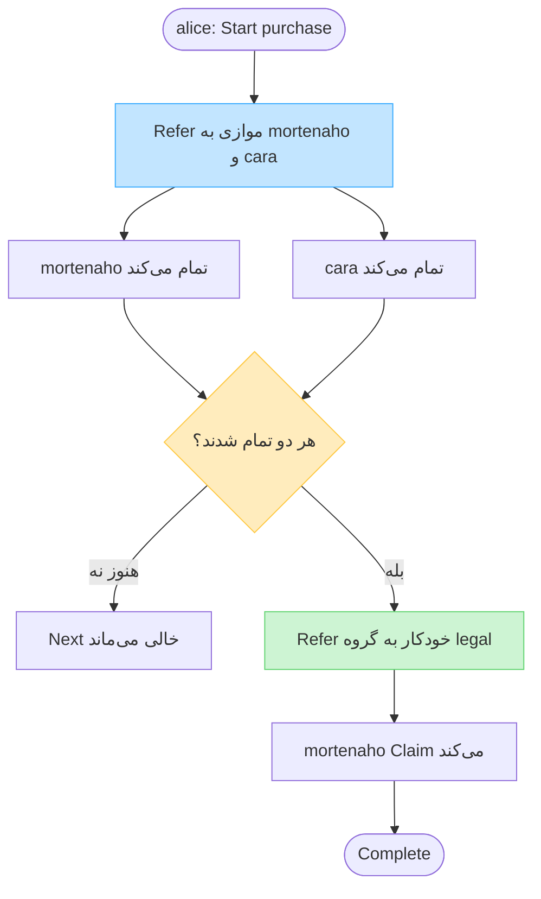

<div dir="rtl">

# نمونه‌ها و سناریوها

اجرای سرور REST با دستور `dotnet run --project src/TaskFlow.Server` روی پورت `:8081` (پروفایل پیش‌فرض `Development` است و بدون `WF_API_KEYS` کار می‌کند). اگر سرور را با Docker یا محیط Production اجرا می‌کنید، کلید را در `WF_API_KEY` یا `WF_API_KEYS` بگذارید تا `curl.sh` آن را به‌صورت `X-API-Key` بفرستد. این اسکریپت معادل بک‌اند است؛ کلید را در React کپی نکنید. معماری پیشنهادی: [docs/architecture.md](../docs/architecture.md#api-key-architecture).

<div dir="ltr">

```bash
./examples/curl.sh
dotnet run --project examples/Scenario
```

</div>

## سناریوی خرید: موازی → حقوقی

`alice` فرایند `purchase` را شروع می‌کند و هم‌زمان به `mortenaho` و `cara` ارجاع می‌دهد. تکمیل‌ها از `ProcessOrchestrator.CompleteAndAdvance` می‌گذرند؛ فقط وقتی **هر دو** تمام شدند، ارجاع گروهی به `legal` خودکار ساخته می‌شود. بعد `mortenaho` آن را Claim و Complete می‌کند.

### دیاگرام ساده

<div dir="ltr">



</div>

### نکتهٔ مهم

موتور به‌تنهایی مرحلهٔ بعد را اجرا نمی‌کند؛ `CompleteAndAdvance` فقط وقتی `allCompleted` شود callback شما را به یک `Refer` تبدیل می‌کند. توضیح کامل‌تر: [docs/usage.md](../docs/usage.md#ارجاع-موازی-و-رفتن-خودکار-به-مرحله-بعد).

</div>
