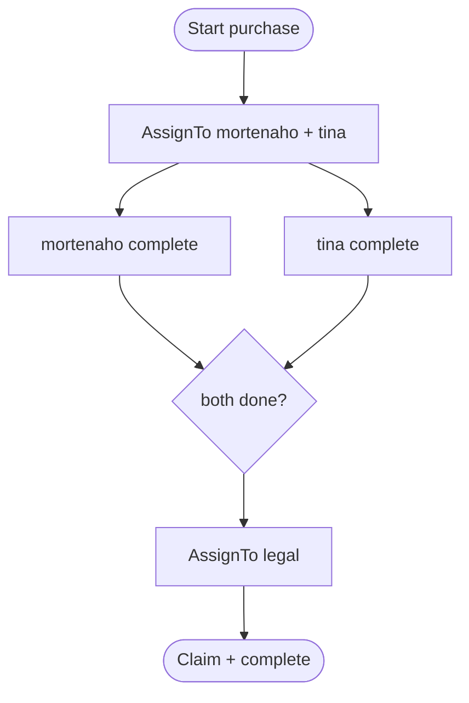

<div dir="rtl">

# نمونه‌ها

سرور: `dotnet run --project src/TaskFlow.Server` روی `:8081`. برای `curl.sh` در Production کلید را در `WF_API_KEY` بگذارید.

<div dir="ltr">

```bash
./examples/curl.sh
dotnet run --project examples/Scenario
```

</div>

## خرید: موازی → حقوقی

`sara` فرایند `purchase` را start می‌کند و به `mortenaho` و `tina` ارجاع می‌دهد (`onAllCompleted` → گروه `legal`). بعد از join، `mortenaho` تسک حقوقی را claim و complete می‌کند.

<div dir="ltr">



</div>

BFF: [docs/usage.md#bff](../docs/usage.md#bff)

</div>
